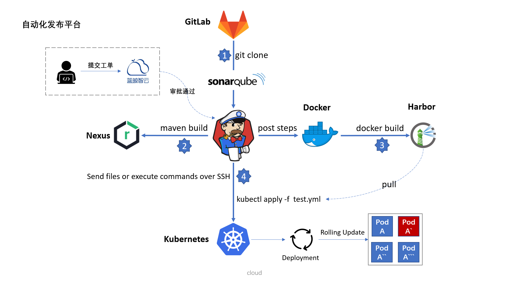

 
<b>Spring Cloud & Kubernetes & Istio</b>
  

 

  
  
  
  

## :bulb: 简介 

容器技术已成为互联网公司应用部署、运维的标配，作为云服务时代的研发，不可避免的要去了解 Docker、Kubernetes、Istio 这些技术，如果在你实际的工作中没有涉及到，仅仅靠阅读理论概念，熟悉起来可能比较困难一点，本专栏会通过一个微服务示例，来让你在实际操作中去了解它。

前面几节会介绍配置中心、注册中心以及 Docker 容器在实际使用过程中遇到过的一些问题，有哪些解决方法。

在微服务示例中提供了单机版容器编排文件 docker-compose.yml，可以在单机环境下一键将微服务启动测试；并且在每个微服务中都提供了标准的 Kubernetes 资源描述文件（Service、Deployment、ReplicaSet、Pod），包括 Ingress、Istio 的部署文件，这些服务配置都已经在本地经过多轮部署测试，让你可以拿来即用。

专栏中会介绍对比 Spring Cloud、Kubernetes、Istio 中怎么实现网关的角色？云服务时代的自动化发布体系是什么样的？以及 Kubernetes 平台中如何平稳的更新服务，如何快速回滚版本？

## :loudspeaker: 专栏地址 

- GitChat: [https://gitbook.cn/gitchat/author/5aed0eb0653f1830e347fb1f](https://gitbook.cn/gitchat/author/5aed0eb0653f1830e347fb1f)

## :sparkles: 专栏目录

- [01]. 配置中心为什么选择携程 Apollo
- [02]. Eureka 客户端已经成功下线，为什么还会有请求流入
- [03]. Docker 中的服务为什么没有 Graceful Shutdown
- [04]. Kubernetes 基于 DNS 的服务注册与服务发现
- [05]. Spring Cloud Gateway 作为云服务的 API 网关
- [06]. Ingress 作为 Kubernetes 集群访问入口
- [07]. Istio Ingress Gateway 网关介绍、演示
- [08]. 云服务时代的自动化发布体系介绍
- [09]. Kubernetes 中如何滚动更新和回滚版本
- [10]. Docker、Docker Compose、Harbor 的使用
- [11]. 一键部署利器 Kubeadm 搭建 Kubernetes

## :book: API 

 

## :clapper: 图片展示

 
 
 
 
 

 

 

 